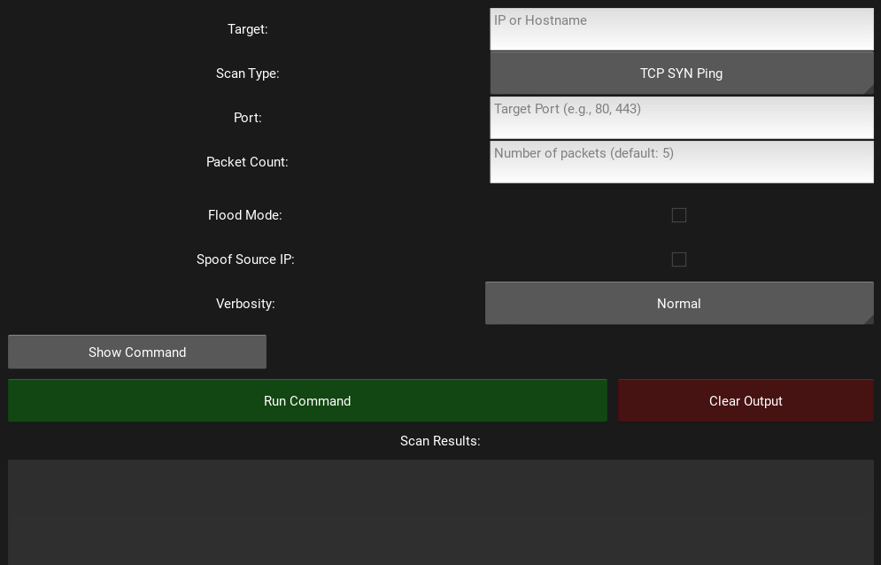

# Hping3 GUI

A graphical user interface for the Hping3 network tool, built with Python and Kivy. This application provides an intuitive interface for running various types of network scans and tests using Hping3.

## Screenshots



## Features

- **User-Friendly Interface**: Easy-to-use GUI for Hping3 commands
- **Multiple Scan Types**:
  - TCP SYN Ping
  - UDP Ping
  - ICMP Echo Ping
  - TCP ACK Ping
  - SYN Flood
  - UDP Flood
- **Advanced Options**:
  - Customizable packet count
  - Flood mode
  - Source IP spoofing
  - Adjustable verbosity levels
- **Real-Time Command Preview**: See the exact Hping3 command as you configure options
- **Results Display**: View scan results directly in the application
- **Clear Output Function**: Easily clear previous scan results

## Prerequisites

- Python 3.x
- Kivy framework
- Hping3 tool
- Root/sudo privileges (required for Hping3)

## Installation

1. First, ensure you have Python 3.x installed:
   ```bash
   python3 --version
   ```

2. Install Hping3:
   ```bash
   sudo apt-get update
   sudo apt-get install hping3
   ```

3. Install the required Python packages:
   ```bash
   pip3 install -r requirements.txt
   ```

4. Clone this repository:
   ```bash
   git clone https://github.com/Saumbhavi2310/hping3-GUI.git
   cd hping3-GUI
   ```

## Usage

1. Launch the application with root privileges:
   ```bash
   sudo python3 hping3GUI.py
   ```

2. Configure your scan:
   - Enter `target IP` or `hostname`
   - Select `scan type`
   - Configure `port number` (if applicable)
   - Set `packet count`

3. View/edit the generated command by toggling the `Show Command` button

4. Click `Run Command` to execute the scan

5. View results in the output area

6. Use `Clear Output` to reset the results display

## Security Considerations

- This tool requires root privileges to run Hping3 commands
- Use responsibly and only on networks you have permission to test
- Be aware that some scan types (particularly flood options) can be intensive
- Ensure you understand the implications of each scan type before use

## Features in Detail

### Target Configuration
- IP address or hostname input
- Port number selection
- Packet count customization

### Scan Types
- **TCP SYN Ping**: Basic TCP ping using SYN packets
- **UDP Ping**: UDP-based ping test
- **ICMP Echo Ping**: Standard ICMP ping
- **TCP ACK Ping**: TCP ping using ACK packets
- **SYN Flood**: TCP SYN flood test
- **UDP Flood**: UDP flood test

### Advanced Options
- **Flood Mode**: Rapid packet transmission
- **Source IP Spoofing**: Randomize source IP
- **Verbosity Levels**: Quiet, Normal, or Verbose output

## Troubleshooting

Common issues and solutions:

1. **Permission Denied**
   - Ensure you're running the application with sudo
   - Check that Hping3 is properly installed

2. **Command Not Found**
   - Verify Hping3 installation
   - Check system PATH

3. **Invalid Target**
   - Ensure target IP/hostname is valid
   - Check network connectivity

## Contributing

1. Fork the repository
2. Create your feature branch (`git checkout -b feature/AmazingFeature`)
3. Commit your changes (`git commit -m 'Add some AmazingFeature'`)
4. Push to the branch (`git push origin feature/AmazingFeature`)
5. Open a Pull Request

## License

This project is licensed under the MIT License - see the LICENSE file for details

## Disclaimer

This tool is meant for network testing and educational purposes only. Users are responsible for ensuring they have proper authorization before scanning any networks or systems.

## Authors

- [Saumbhavi2310](https://github.com/Saumbhavi2310)

## Acknowledgments

- Hping3 developers for the original command-line tool
- Kivy framework developers